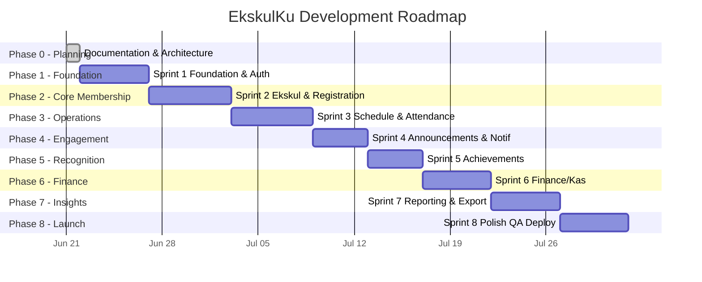

# development_roadmap.md — EkskulKu

## Document Info

| Field | Detail |
|---|---|
| **Purpose** | Phase-level delivery plan — sits above `Sprint_Task_Breakdown.md` for stakeholder-facing tracking |
| **Last Updated** | 2026-06-21 |

---

## 1. Roadmap Overview



> Durations assume a single AI-assisted developer working in 15–45 min focused sessions, multiple sessions per day. Adjust pacing to actual team capacity — the **sequence and dependencies** are the fixed part, not the calendar dates.

---

## 2. Phase Breakdown

### Phase 0 — Planning ✅ Complete
**Outcome:** All 10 documentation artifacts produced and locked as source of truth.
- PRD, database design, API contract, RBAC matrix, component tree, folder structure, sequence diagrams, sprint breakdown, project context, this roadmap.

### Phase 1 — Foundation & Auth (Sprint 1)
**Outcome:** Anyone can log in as any of the 4 roles and land on a correctly-gated dashboard shell.
**Dependency:** Nothing — this is the starting point.
**Risk:** NextAuth + Prisma adapter misconfiguration is the most common stumbling block. Verify `session.user.role` is populated correctly before moving to Phase 2.

### Phase 2 — Core Membership (Sprint 2)
**Outcome:** Full registration-to-active-member pipeline working, including the approval workflow (Decision #6).
**Dependency:** Phase 1 auth + role guards.
**Risk:** The unique constraint `(studentId, extracurricularId)` must be tested against the "register for multiple different ekskul" case (Decision #2) to confirm it does NOT block legitimate multi-ekskul registration — only true duplicates.

### Phase 3 — Operations (Sprint 3)
**Outcome:** Pembina can schedule sessions (with dual conflict warnings) and take digital attendance with all 5 statuses.
**Dependency:** Phase 2 (memberships must exist for attendance session member lists to populate).
**Risk:** Conflict detection logic (student + room) is the most algorithmically complex piece in the MVP — budget extra QA time here.

### Phase 4 — Engagement (Sprint 4)
**Outcome:** Announcements flow end-to-end; in-app notification system is live and wired to registration approval/rejection + schedule changes.
**Dependency:** Phase 1 (users/roles), Phase 2 (memberships, for scoping recipients), Phase 3 (schedule changes as a trigger source).
**Risk:** Notification fanout queries (find all members + parents of an ekskul) can be slow at scale if not indexed — confirm `@@index` usage from `database_design.md` is in place.

### Phase 5 — Recognition (Sprint 5)
**Outcome:** Competitions and achievements fully tracked, visible to students/parents, feeding into Phase 7 reports.
**Dependency:** Phase 1–2 (roles, memberships).
**Risk:** Low — this module is largely independent CRUD with one state machine.

### Phase 6 — Finance (Sprint 6)
**Outcome:** Complete income/expense tracking, balance visibility, automated overdue detection + reminder notifications.
**Dependency:** Phase 2 (students/memberships to attach payments to), Phase 4 (notification infrastructure for `PAYMENT_REMINDER`).
**Risk:** Cron jobs on Vercel require correct `vercel.json` configuration and `CRON_SECRET` — test in preview environment before relying on it in production.

### Phase 7 — Insights (Sprint 7)
**Outcome:** PDF + Excel export working for all 4 report types (Member, Attendance, Achievement, Finance), scoped per role.
**Dependency:** Phases 2, 3, 5, 6 (all data sources must exist to report on).
**Risk:** PDF/Excel generation libraries can be memory-heavy on serverless — test with realistic data volumes (hundreds of students) before launch, not just seed data.

### Phase 8 — Polish, QA & Launch (Sprint 8)
**Outcome:** Admin dashboard complete, full RBAC audit passed, mobile QA passed, deployed to production.
**Dependency:** All prior phases.
**Risk:** RBAC audit (S8-T4) is the most important gate before launch — a missed scope check anywhere is a data leak across roles (e.g., a Pembina seeing another coach's financial data).

---

## 3. Critical Path

```
Phase 1 (Auth) 
   → Phase 2 (Membership) 
      → Phase 3 (Schedule/Attendance) ─┐
      → Phase 5 (Achievements) ────────┤
      → Phase 6 (Finance) ─────────────┤→ Phase 7 (Reports) → Phase 8 (Launch)
   → Phase 4 (Notifications, needs Phase 2 + feeds Phase 3/6) ┘
```

Phases 3, 5, and 6 can be parallelized by separate AI sessions **once Phase 2 is complete**, since they don't depend on each other directly — only Phase 7 (Reporting) needs all three finished.

---

## 4. Milestones

| Milestone | Marks Completion Of | Demo-able? |
|---|---|---|
| **M1 — Auth Live** | Phase 1 | Yes — login as all 4 roles |
| **M2 — Registration Pipeline Live** | Phase 2 | Yes — full register → approve → become member flow |
| **M3 — Daily Operations Live** | Phase 3 | Yes — Pembina runs a real attendance session with conflict-checked schedule |
| **M4 — Communication Layer Live** | Phase 4 | Yes — announcement triggers a visible in-app notification |
| **M5 — Recognition Live** | Phase 5 | Yes — competition recorded, achievement visible to parent |
| **M6 — Finance Live** | Phase 6 | Yes — dues recorded, overdue auto-flagged, reminder sent |
| **M7 — Reporting Live (MVP Feature-Complete)** | Phase 7 | Yes — Admin exports a real PDF/Excel report |
| **M8 — Production Launch** | Phase 8 | Yes — live URL, all roles smoke-tested |

---

## 5. Post-MVP / Future Roadmap (Not Scheduled)

| Idea | Notes |
|---|---|
| Online payment gateway (Midtrans/Xendit) | Currently dues are manually recorded by Admin/Pembina (PRD §3 Non-Goals) |
| Email / push notifications | Explicitly deferred — in-app only for MVP (Decision #7) |
| Multi-school / multi-tenant support | Current scope is single-school instance |
| Native mobile app | Responsive web only for MVP |
| Pembina-initiated ekskul creation | Currently Admin-only (Open Question #1 in PRD) |
| Bulk import (CSV) for student data | Manual entry only in MVP |
| Parent push opt-in for urgent announcements | Depends on future notification channel work |

---

## 6. How to Use This Document

- **Stakeholders:** Use §1 (Gantt) and §4 (Milestones) for status updates.
- **AI coding assistants:** Use §3 (Critical Path) to understand what can be safely parallelized vs. what must be sequential, then drop into `Sprint_Task_Breakdown.md` for the actual session-sized tasks.
- **Tech Lead:** Use §2 (Risk notes per phase) to front-load QA attention on the genuinely hard parts (conflict detection, RBAC audit, cron reliability) rather than spreading review effort evenly.
