# sequence_diagrams.md — EkskulKu

## Document Info

| Field | Detail |
|---|---|
| **Format** | Mermaid `sequenceDiagram` |
| **Purpose** | Updated flows reflecting all 12 agreed decisions (approval workflow, notifications, dual conflict detection, finance) |
| **Last Updated** | 2026-06-21 |

---

## 1. Registration with Approval Workflow (Decision #6)

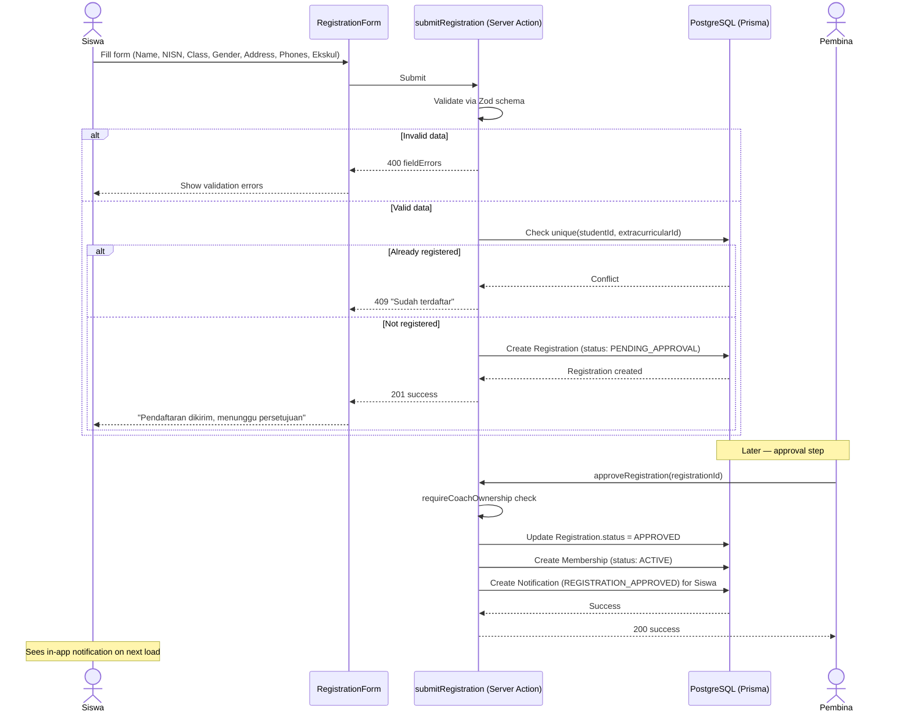

---

## 2. Registration Rejection Flow

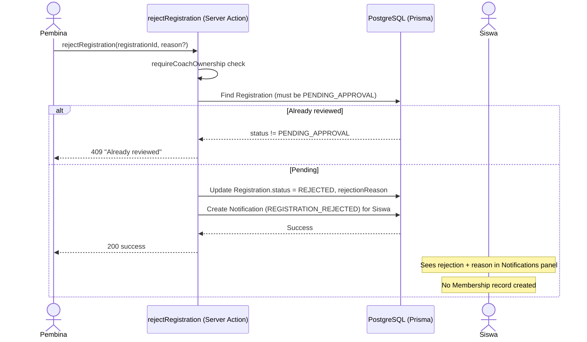

---

## 3. Digital Attendance (5-Status Enum — Decision #12)

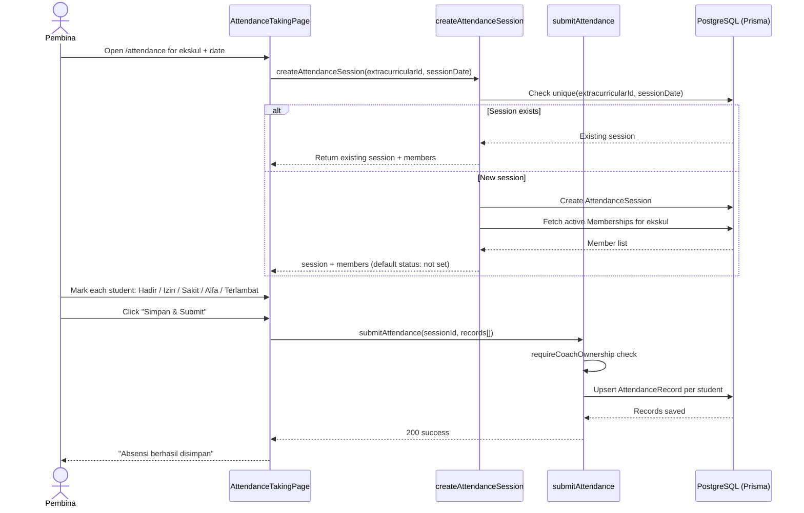

---

## 4. Schedule Creation with Dual Conflict Detection (Decision #8)

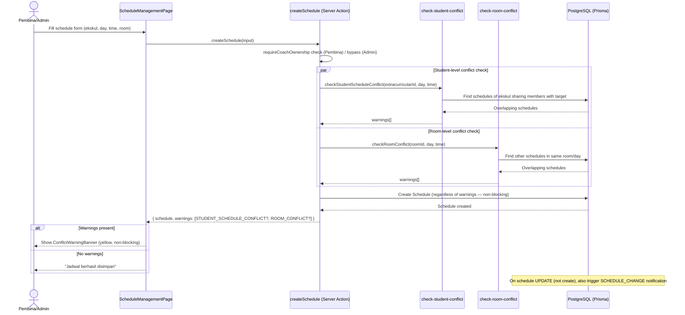

---

## 5. Schedule Change Notification (Decision #7)

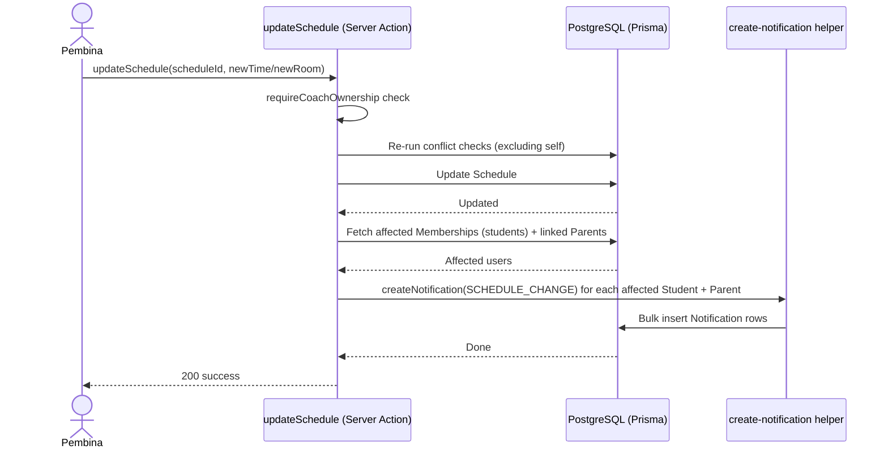

---

## 6. Announcement Publish Flow with Notification Fanout

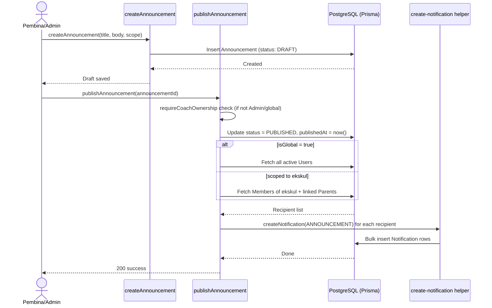

---

## 7. Achievement & Competition Lifecycle

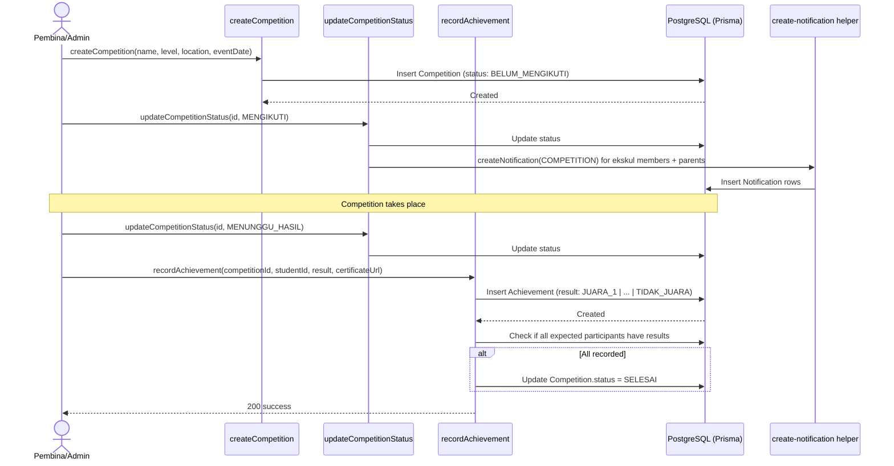

---

## 8. Finance — Income (Dues) Payment Flow (Decision #5, #10)

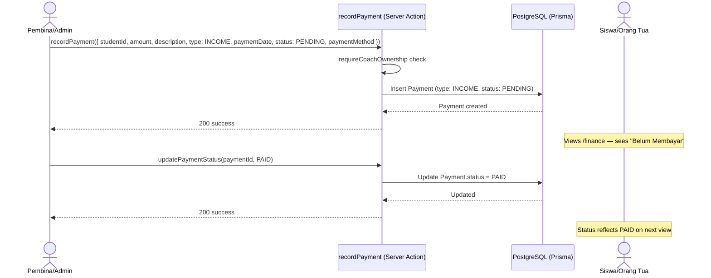

---

## 9. Finance — Overdue Detection & Payment Reminder (Decision #7, #10 — Cron)

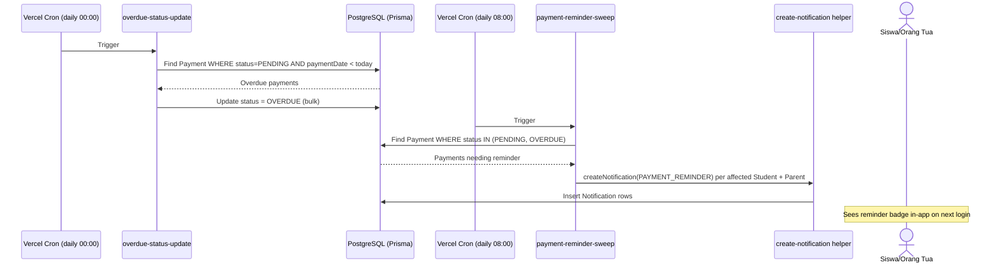

---

## 10. Finance — Expense Recording Flow

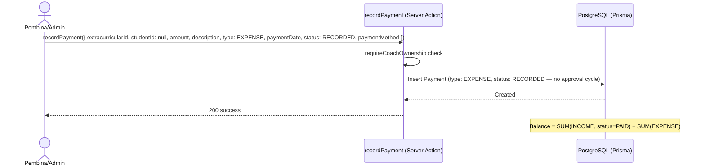

---

## 11. Finance — Cash Balance Calculation (Read Flow)

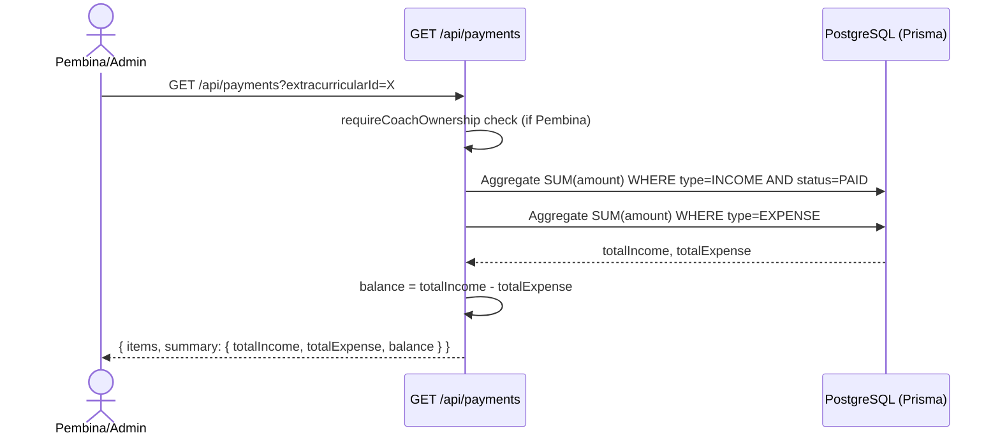

---

## 12. Report Generation & Export (PDF/Excel — Decision #9)

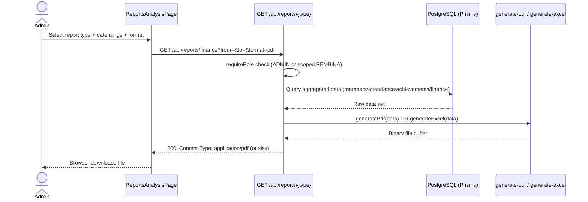

---

## 13. Login & Role Validation (Decision #11)

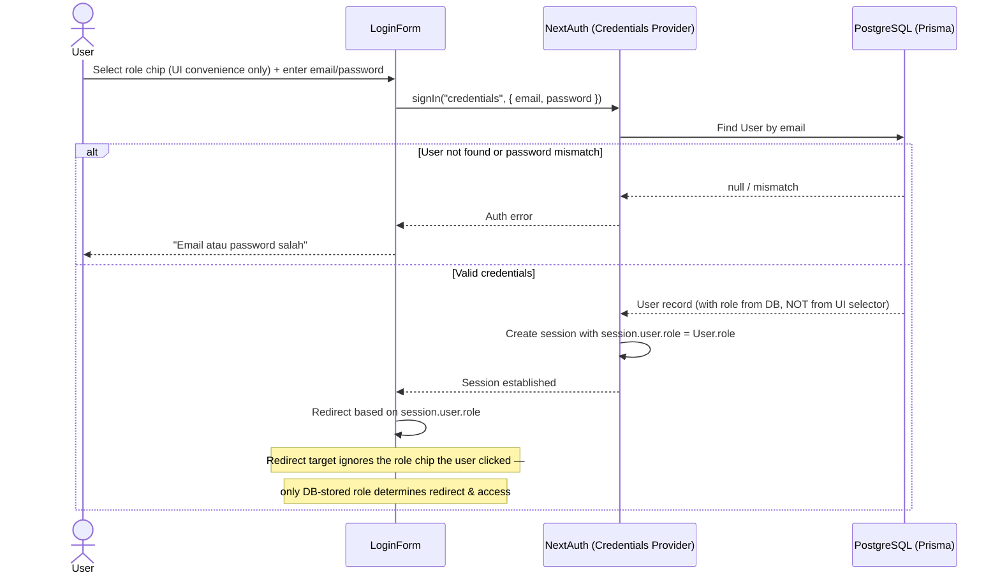

---

## 14. In-App Notification Read Flow

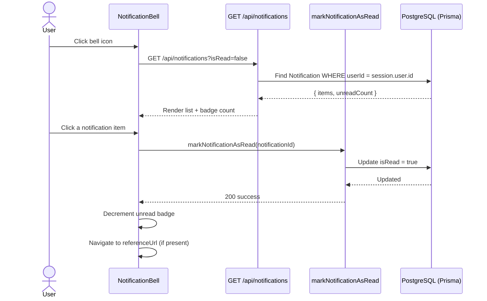
